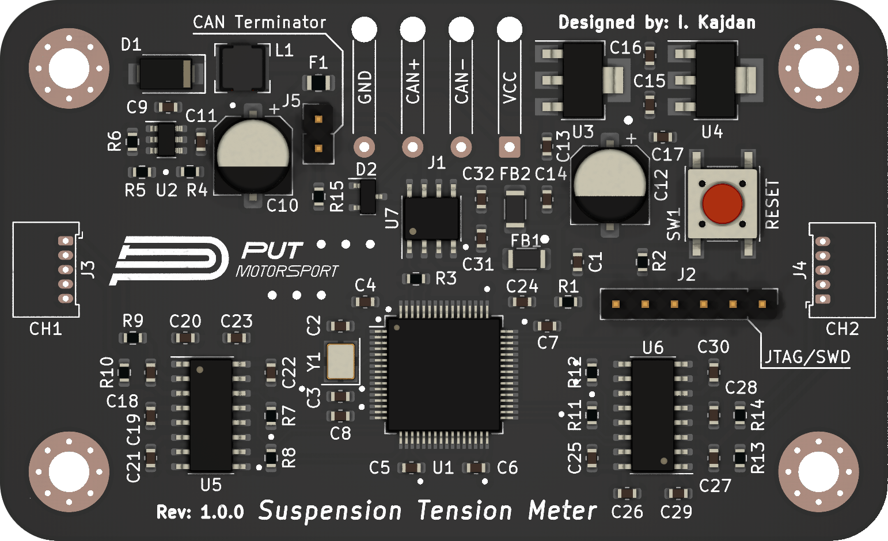

# Suspension Tension Meter

This circuit is supposed to measure uniaxial forces acting on the push-rodes and send collected data over the CAN bus.

<p align="center">
  
</p>

## Build

1. Clone the repository:
    ```
    git clone --recurse-submodules 'https://github.com/PUT-Motorsport/PUTM_EV_SUSPENSION_TENSION_METER_2023.git'
    ```
1. Import the project into the CubeIDE.
1. Temporarily rename `main.cpp` to `main.c`.
1. Run the Device Configuration Tool to update the code.
1. Rename `main.c` back to `main.cpp`.


## Firmware

The [Adafruit library](https://github.com/adafruit/Adafruit_NAU7802) and [this project](https://github.com/alex7709/ECE4180F19_CAN_Project) have been used as a reference for writing the driver for the NAU7802.

## Hardware

- [STM32L4P5RET6](https://www.st.com/resource/en/datasheet/stm32l4p5ae.pdf)
- [NAU7802 24-bit ADC](https://www.nuvoton.com/resource-files/NAU7802%20Data%20Sheet%20V1.7.pdf)
- [EMS20 Shear-web Load Cell](https://www.memidos.com/wp-content/uploads/2022/09/EMS20_en.pdf)

## License

    Copyright 2022 Ignacy Kajdan
    
    Licensed under the Apache License, Version 2.0 (the "License");
    you may not use this file except in compliance with the License.
    You may obtain a copy of the License at
    
      https://www.apache.org/licenses/LICENSE-2.0
    
    Unless required by applicable law or agreed to in writing, software
    distributed under the License is distributed on an "AS IS" BASIS,
    WITHOUT WARRANTIES OR CONDITIONS OF ANY KIND, either express or implied.
    See the License for the specific language governing permissions and
    limitations under the License.
